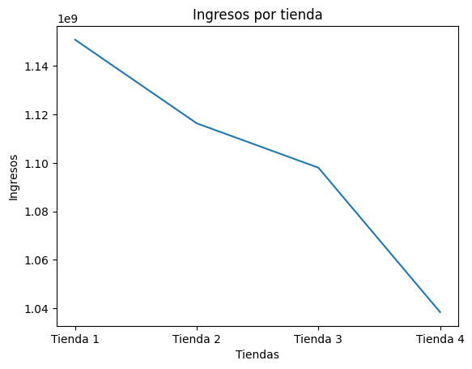
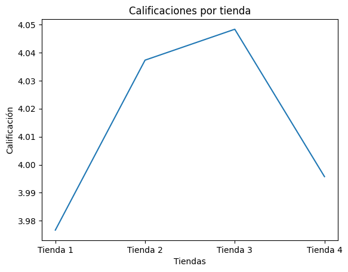

# Primer Challenge de Especialización de Data Science de Oracle y Alura

----------------------------  

# Índice
- [1.Instalación](#1-Instalación)
- [2.Descripción](#2-Descripción)
- [3.Estructura del proyecto y organización de los archivos](#3-Estructura-del-proyecto-y-organización-de-los-archivos)
- [4.Ejemplos de gráficos e insights obtenidos](#4-Ejemplos-de-gráficos-e-insights-obtenidos)
- [5.Instrucciones para ejecutar el notebook](#5-Instrucciones-para-ejecutar-el-notebook)
----------------------------               

# 1. Instalación
Sigue a continuación los siguientes comandos:

```bash
# Clona este repositorio
git clone https://github.com/PedroB6/Challenge1_DataScience-Oracle-Alura

# Entra en el directorio del proyecto
cd Challenge1_DataScience-Oracle-Alura

```

# 2. Descripción

El propósito de este proyecto es ayudar al señor Juan a decidir cual de sus 4 tiendas vender para invertir en un nuevo negocio, considerando la que tiene menor desempeño.

# 3. Estructura del proyecto y organización de los archivos

1. Con la librería de pandas se leen en el Google Colab los archivos CSV que contienen información de las 4 tiendas en 4 archivos diferentes.
2. Se comprendió la información que contiene cada columna, para entender los datos, realizando los siguientes pasos replicándose para cada tienda:
   
   2.1. Análisis de facturación: Cálculo los ingresos totales.
   
   2.2. Ventas por categoría: Cálculo de la cantidad de ventas por categoría.
   
   2.3. Calificación promedio de la tienda: Cálculo de la saisfacción de los clientes con los productos vendidos.

   2.4. Productos más y menos vendidos: Cálculo de los 5 productos más y menos vendidos.

   2.5. Envío promedio por tienda: Cálculo del costo de envío promedio.

3. Se generaron algunos gráficos de interés.

# 4. Ejemplos de gráficos e insights obtenidos

La cantidad de ingresos por tienda alcanza su pico en la tienda 1 y disminuye hasta la 4


La tienda 4 es la segunda con menor calficación entre las 4: 



# 5. Instrucciones para ejecutar el notebook

Subir al Google Colab personal, la copia del archivo con extensión ".ipynb" y ejecutar las celdas.

